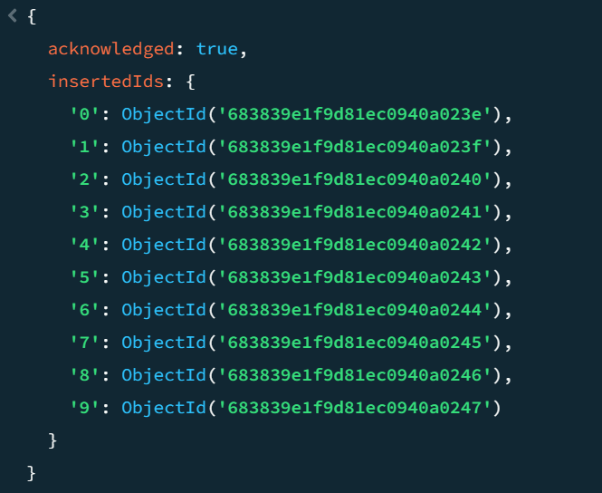
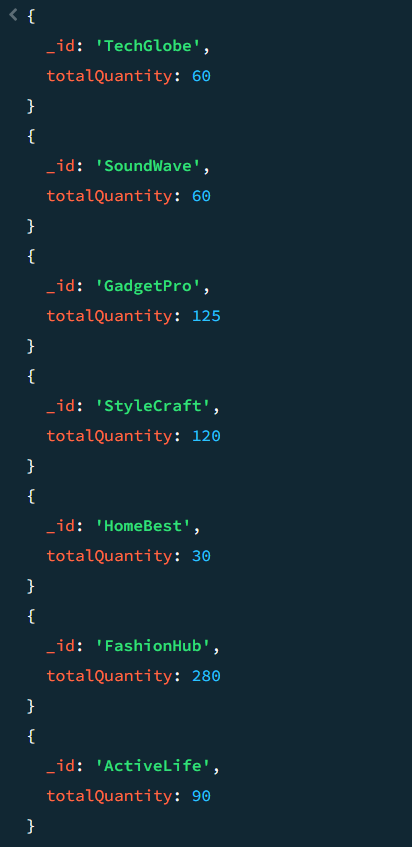
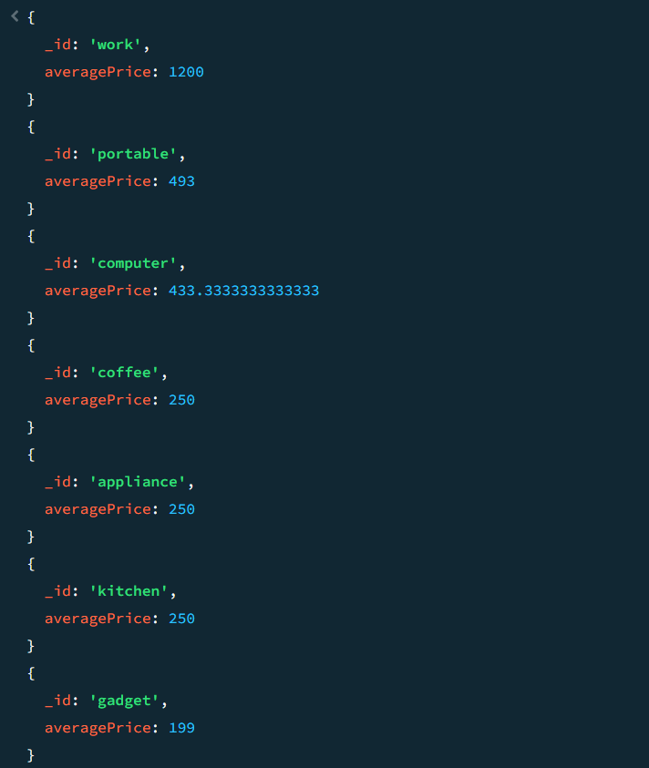
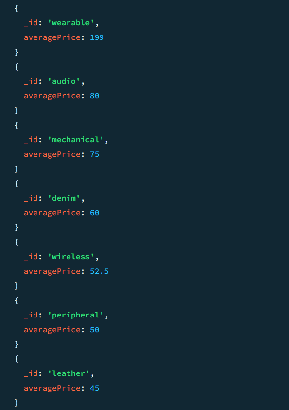
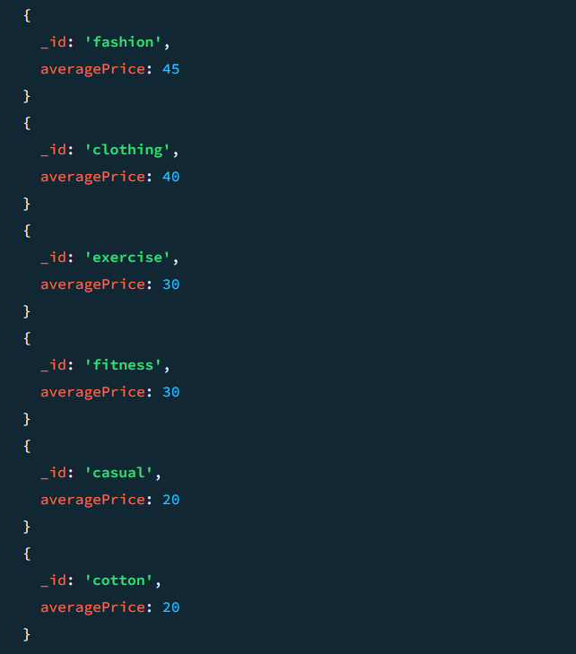

## MongoDB Assignment

### 1. Switch to a new database (or an existing test database):
- use aggregationAssignmentDB
- switched to db aggregationAssignmentDB

### 2. Insert the following sample data into a collection named products:
- db.products.insertMany(  
  { name: "Laptop Pro", category: "Electronics", price: 1200, quantity: 10, tags: ["computer", "portable", "work"], date_added: new Date("2023-01-15T10:00:00Z"), supplier: { name: "TechGlobe", location: "USA" } },  
  { name: "Wireless Mouse", category: "Electronics", price: 25, quantity: 100, tags: ["peripheral", "computer", "wireless"], date_added: new Date("2023-02-01T11:30:00Z"), supplier: { name: "GadgetPro", location: "China" } },  
  { name: "Mechanical Keyboard", category: "Electronics", price: 75, quantity: 50, tags: ["peripheral", "computer", "mechanical"], date_added: new Date("2023-01-20T14:00:00Z"), supplier: { name: "TechGlobe", location: "USA" } },  
  { name: "Cotton T-Shirt", category: "Apparel", price: 20, quantity: 200, tags: ["clothing", "cotton", "casual"], date_added: new Date("2023-03-10T09:00:00Z"), supplier: { name: "FashionHub", location: "India" } },  
  { name: "Denim Jeans", category: "Apparel", price: 60, quantity: 80, tags: ["clothing", "denim"], date_added: new Date("2023-03-01T16:45:00Z"), supplier: { name: "FashionHub", location: "India" } },  
  { name: "Espresso Machine", category: "Home Goods", price: 250, quantity: 30, tags: ["kitchen", "appliance", "coffee"], date_added: new Date("2023-02-15T08:20:00Z"), supplier: { name: "HomeBest", location: "Germany" } },  
  { name: "Smartwatch", category: "Electronics", price: 199, quantity: 25, tags: ["wearable", "gadget", "portable"], date_added: new Date("2023-04-01T12:00:00Z"), supplier: { name: "GadgetPro", location: "China" } },  
  { name: "Leather Wallet", category: "Accessories", price: 45, quantity: 120, tags: ["fashion", "leather"], date_added: new Date("2023-03-20T10:10:00Z"), supplier: { name: "StyleCraft", location: "Italy" } },  
  { name: "Yoga Mat", category: "Sports", price: 30, quantity: 90, tags: ["fitness", "exercise"], date_added: new Date("2023-04-05T13:00:00Z"), supplier: { name: "ActiveLife", location: "USA" } },  
  { name: "Bluetooth Speaker", category: "Electronics", price: 80, quantity: 60, tags: ["audio", "portable", "wireless"], date_added: new Date("2023-02-25T17:00:00Z"), supplier: { name: "SoundWave", location: "USA" } }  
)
- 

## Medium Difficulty

### 1. Total Quantity of Products by Supplier:
- db.products.aggregate(
  { $group: {
      _id: "$supplier.name",
      totalQuantity: { $sum: "$quantity" } } 
      } )
- 

### 2. Average Price of Products per Tag:
- db.products.aggregate(
  { $unwind: "$tags" },
  { $group: {
      _id: "$tags",
      averagePrice: { $avg: "$price" }
    } },
 {
    $sort: {
      averagePrice: -1
    }
  } )
- 
- 
- 

### 3. Products Added in February 2023:
- 